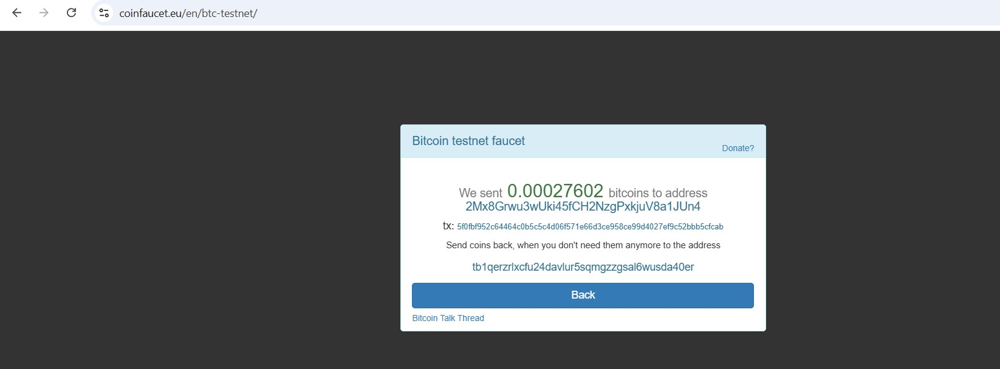
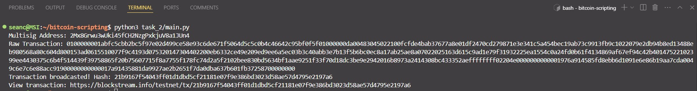

# Bitcoin's Scripting Language

## TASK 1:
- **Run**: `python3 task_1/spend_locked_funds.py`
- **Explanation**:
  - **Lock Funds**: Use a Bitcoin testnet faucet to send testnet BTC to the generated Bitcoin address. ([Transaction detail](https://blockstream.info/testnet/tx/95f0a4ac7fe1b7446b1d165c4ae732803bdbc518d0b1d99badbb928a44d61c14))
  - `moaEaXS2d3ZoPVDWL9vwtMZxL7gURMHJwy` is the sender's Bitcoin address (a.k.a change address).
  - **Unlock Funds**: Spend the locked funds (output of faucet tx) by creating a transaction that sends the funds to recipient's address (`mkT3YKrMPgchhMy1AVyVvhQbYtFcwr9uJ7`).
  - **Broadcast Transaction**: ([Transaction detail](https://blockstream.info/testnet/tx/b30c54748a0f4b5ced04d0da06425fe7bb84e3464b2247af19c8e9330d84f69b))
  ```
  Raw Transaction: 0100000001141cd6448a92bbad9bd9b1d018c5db3b8032e74a5c161d6b44b7e17faca4f095000000006a473044022024014fe42e856314a4062e8b13394dc2806e9020c625c71f717e19baa5b68228022047cedabec141698aa32fd5c7d6313e2d2c91504f9db1c1a92f67efb5e4925326012102af35fb9ecd89fa081e6192182deecf48288efa3a9d2382ed3db7296924df7485ffffffff0288130000000000001976a914361b5821df44a94d25746877be41a7bd7dfb9d7a88aca00f0000000000001976a914585fd8ebb6d1091e6e86b19aa7cda0049c6e7c6e88ac00000000
  Transaction broadcasted! Hash: a182546af9505d67ea818c736bdd1e95cf0b5588ea68a649ee9ba430a4168129
  View transaction: https://blockstream.info/testnet/tx/a182546af9505d67ea818c736bdd1e95cf0b5588ea68a649ee9ba430a4168129
  ```

## TASK 2:
- **Run**: `python3 task_2/main.py`
- **Explanation**:
  - **Create a 2-of-2 Multisig Address**: 
  ```
  def create_multisig(sender1_pubkey, sender2_pubkey):
    redeem_script = get_redeem_script(sender1_pubkey, sender2_pubkey)
    address = P2SHBitcoinAddress.from_redeemScript(redeem_script)
    return address
  
  multisig_address = create_multisig(sender_1['public_key'], sender_2['public_key']) #2Mx8Grwu3wUki45fCH2NzgPxkjuV8a1JUn4
  print("Multisig Address:", multisig_address)
  ```
  - **Lock Funds**: Use a Bitcoin testnet faucet to send testnet BTC to the generated Multisig address. ([Transaction detail](https://blockstream.info/testnet/tx/5f0fbf952c64464c0b5c5c4d06f571e66d3ce958ce99d4027ef9c52bbb5cfcab))
  
  - `2Mx8Grwu3wUki45fCH2NzgPxkjuV8a1JUn4` is the Multisig address (a.k.a change address).
  - **Unlock Funds**: Spend the locked funds (output of faucet tx) by creating a transaction that sends the funds to recipient's address (`moaEaXS2d3ZoPVDWL9vwtMZxL7gURMHJwy`).
  - **Broadcast Transaction**: ([Transaction detail](https://blockstream.info/testnet/tx/21b9167f54043ff01d1dbd5cf21181e07f9e386bd3023d58ae57d4795e2197a6))
  